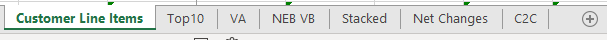
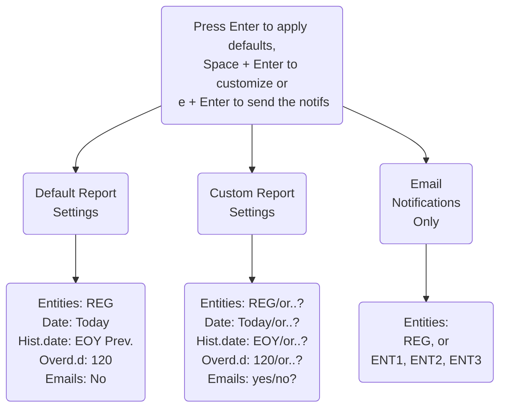

Purpose
-
- The Purpose of the project is to automate the process of generating  
  the Accounts Receivables reports based on the SAP R/3 data.  
  The reports are generated in the excel format, synced with  
  the Sharepoint, and sent to the Business Users via email notifications  
  depending from the settings made by a user in the Command Line Interface.  

Functionality
-
- The script looks for the last version of the Accounts Receivables  
  report in the folder that is synced with the Sharepoint.  
- Moves the last version from the synced folder to the temporary folder,  
  and takes additional copy to the archive folder.  
- Based on the parameters set by the user in the Command Line Interface ([see below](#command-line-interface-cli))  
  the script retrieves SAP data to the temporary excel files ([see below](#temporary-files)).  
- Creates temporary png files with the charts.  
- Based on the framework of the old Report copy (retaining existing Pivots), and  
  by using the fresh temporary files, it compiles the new version of the  
  Accounts Receivables report in the temporary folder.  
- User comments from the old version of the Accounts Receivables report  
  are indexed and carried forward to the new version.  
- Retains the temporary files until the next run (in case of other use, etc.).  
- Moves the new version of the Accounts Receivables report from the temporary  
  folder to the folder that is synced with the Sharepoint.  
- Notifies the business users via email.  

Requirements
-
- SAP R/3 system;
- Python;
- MS Office;
- Sharepoint;
- Baseline data  (existing versions of the Accounts Receivables report);

Limitations
-
- The system data is retrieved by using the SAP Sreen Recorder
  with the SAP (VB) code wrapped in Python.
  Connecting to the SAP Database was not considered in this implementation
  due to the limitations of current user accesses;
- There are non standard SAP transaction codes in use in the script
  (see SAP transaction codes below).

Error handling
-
- Error log file rotation is set to 10 days.
- Log files saved in the directory:'errors'.
- Named as 'error_log_YYYY-MM-DD.txt'.

SAP transaction codes
-
- ZV_QUERY_DL: Query deluxe (non standard tcode),
- FBL5N: Customer line items,
- SQVI: QuickViewer.

Accounts Receivables Report
-
xxx(nnn) AR Data dd-mm-yyyy (hh.mm.ss).xlsx

Sheets of the report file:  

Temporary files
-
xxx ar_data_tmp dd-mm-yyyy (hh.mm.ss).xlsx  
xxx bill_doc_list_tmp dd-mm-yyyy (hh.mm.ss).xlsx  
xxx bridge_data_tmp dd-mm-yyyy (hh.mm.ss).xlsx  
xxx cust_line_items_tmp dd-mm-yyyy (hh.mm.ss).xlsx  
xxx cust_master_tmp dd-mm-yyyy (hh.mm.ss).xlsx  
xxx old_ar_data_tmp dd-mm-yyyy (hh.mm.ss).xlsx  
xxx old_cust_line_items_tmp dd-mm-yyyy (hh.mm.ss).xlsx  
xxx qdl_sap_raw dd-mm-yyyy (hh.mm.ss).xlsx  
xxx qdl_tmp dd-mm-yyyy (hh.mm.ss).xlsx  
xxx stacked_dd-mm-yyyy (hh.mm.ss).xlsx  
[xxx bubble_2d_tmp dd-mm-yyyy (hh.mm.ss).png](pics/bubble_chart_2d.PNG)  
[xxx bubble_3d_tmp dd-mm-yyyy (hh.mm.ss).png](pics/bubble_chart_3d.PNG)  
[xxx wtf_chart_tmp dd-mm-yyyy (hh.mm.ss).png](pics/waterf_chart.PNG)  

Command Line Interface (CLI)
-

